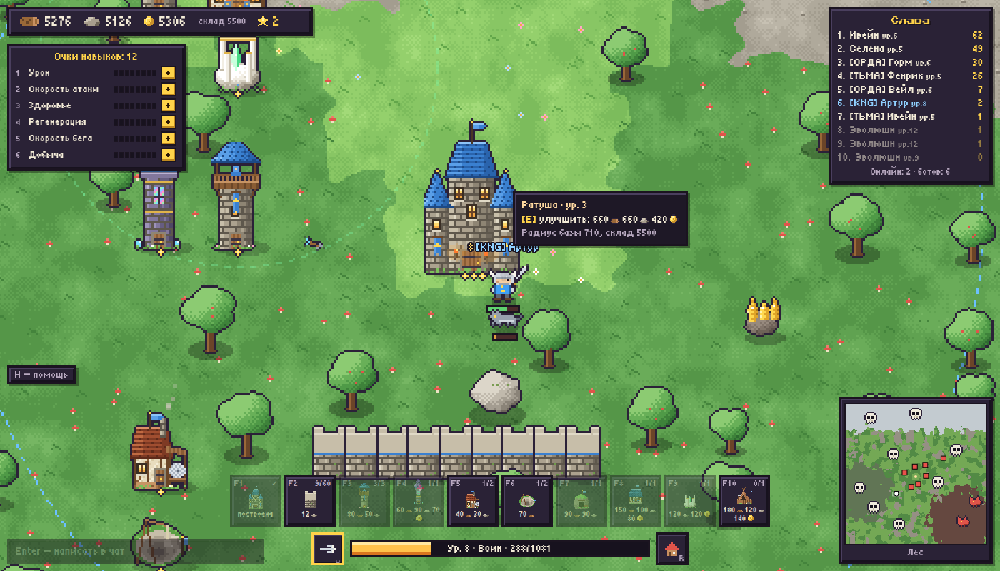

# 🏰 Emberfall — осада королевств

Браузерная фэнтези-**.io**-стратегия, чтобы залипать вечерами с друзьями. Одна огромная карта (25 000×25 000),
на ней все игроки сразу: бегаешь героем как в diep.io, рубишь лес и камень, ставишь крепость как в Clash of Clans,
ходишь в набеги на базы друзей и вместе фармишь боссов.



## Что есть в игре

- **3 класса героя**: ⚔️ Воин (дуга мечом + рывок), 🏹 Следопыт (стрелы + залп из 9 стрел), 🔮 Маг (огненные шары по области + ледяная нова).
- **Прокачка как в diep.io**: опыт → уровни (до 40) → очки в 6 навыков: урон, скорость атаки, здоровье, регенерация, скорость бега, добыча. На старте — 5 очков.
- **Эволюция на 10 уровне** — у каждого класса три пути:
  - Воин → **Кавалерист** (конь, копьё, таран), **Щитоносец** (щит −40% урона спереди, бастион), **Берсерк** (топор, вампиризм, ярость);
  - Следопыт → **Снайпер** (арбалет, пробивающие болты), **Зверолов** (ручные волки, клич стаи), **Ловчий теней** (кинжалы, шаг в тень и невидимость);
  - Маг → **Маг молний** (цепная молния, гроза), **Друид** (шипы, корни, лечение), **Святой маг** (лечащие сферы, аура, благословение).
  - **На 20 уровне** умения усиливаются: бастион отражает снаряды, берсерк крутит вихрь, друид зовёт энтов, стая больше и т.д.
- **Ресурсы**: 🪵 дерево, 🪨 камень, 🪙 золото. Добываются ударами по деревьям, скалам и золотым жилам, падают с монстров и боссов.
- **6 биомов**: луга, лес, горы, снега, болота, вулкан — чем опаснее биом, тем сильнее монстры и жирнее награда.
- **Монстры**: волки, гоблины-лучники, слизни, скелеты, бесы, големы, кабаны (таранят с разбега), гигантские пауки
  (замедляющая паутина), тролли (быстро регенерируют), йети (кидают снежки), саламандры и призраки.
- **NPC-поселения** трёх фракций — гоблинский форт, лагерь разбойников и орочья крепость: дом вождя, башни,
  частокол и стража. Снесите дом вождя — получите много ресурсов и опыта; через 5 минут поселение отстроится.
- **8 видов боссов** (13 логов) со своими паттернами атак (bullet-hell) и анимацией атаки:
  Древний Энт, Король-Лич, Болотная Гидра, Каменный Колосс, Огненный Дракон, Королева пауков,
  Ледяной великан и Минотавр.
  Добыча делится по нанесённому урону, при <40% HP босс впадает в ярость, после смерти возрождается через 3 минуты.
- **10 зданий**: ратуша (точка возрождения, радиус базы, лимиты, склад), стены, башня лучников, башня магов,
  лесопилка, каменоломня, золотой рудник, казарма (рыцари, которые ходят за тобой в набег), святилище (лечит),
  лагерь наёмников (наёмники сами бегут бить ближайших врагов).
  Всё улучшается; ратуша — до 5 уровня, остальные — до 3.
- **PvP и набеги**: все, кто не в твоём клане, — враги. Разрушил чужую ратушу — забрал 30% её запасов.
  Убил героя — украл 20% его золота. Базы остаются на карте, даже когда хозяин офлайн (а шахты приносят доход вполсилы).
- **Кланы**: одинаковый тег клана = союзники (без огня по своим, свои стены пропускают, общий цвет).
- **Боты**: по умолчанию в мире живут 6 ботов — фармят, строят базы, качаются, эволюционируют, ходят в набеги и болтают в чате.
- Чат, облачка сообщений над головами, лента событий, таблица славы, миникарта с базами и логовами.
- Мир сохраняется на диск (`data/world.json`), прогресс привязан к браузеру (токен в localStorage).
- **Графика и звук целиком из кода**: всё рисуется векторно на Canvas, иконки генерируются там же, а звуки и музыка
  синтезируются через Web Audio (`public/audio.js`) — в проекте нет ни одной картинки или аудиофайла.
- **Музыка** меняется по ситуации: тема меню, своя мелодия для каждого биома и боевая тема рядом с боссами и врагами.

## Управление

| Клавиша | Действие |
|---|---|
| **WASD / стрелки** | движение |
| **ЛКМ (зажать)** | атака / добыча |
| **Пробел / ПКМ** | умение класса |
| **F1–F10** | выбрать здание, ЛКМ — поставить (стены можно «рисовать», зажав ЛКМ; Shift — ставить несколько), Esc/ПКМ — отмена |
| **1–6** | вложить очко навыка |
| **E** | улучшить своё здание под курсором |
| **X ×2** | снести своё здание под курсором (вернёт 50%) |
| **R** | телепорт в ратушу (3.5 с, прерывается уроном) |
| **Enter** | чат |
| **M / N** | музыка / звуки вкл-выкл (громкость — в справке) |
| **H** | справка |

## Быстрый старт

Нужен Node.js 18+.

```bash
npm install
npm start
# открыть http://localhost:3000
```

Для разработки: `npm run dev` (перезапуск сервера при изменении файлов), `npm test` — headless-тест симуляции.

## Как играть с друзьями

Сервер один, все подключаются к нему через браузер.

**В одной сети (LAN / общий Wi-Fi).** Запусти `npm start` и дай друзьям адрес `http://<твой-локальный-IP>:3000`.

**Через интернет без сервера — туннель.** На своём компьютере:

```bash
npm start
# в другом терминале, любой из вариантов:
npx cloudflared tunnel --url http://localhost:3000   # Cloudflare Quick Tunnel, бесплатно
npx localtunnel --port 3000
```

Туннель выдаст публичную ссылку `https://…` — кидаешь её друзьям. WebSocket работает через оба варианта.

**На VPS / хостинге (чтобы мир жил 24/7).**

```bash
docker build -t emberfall .
docker run -d -p 3000:3000 -v emberfall-data:/app/data --restart unless-stopped emberfall
```

Подойдёт любой хостинг Node.js с поддержкой WebSocket (Railway, Render, Fly.io, свой VPS).
Порт берётся из переменной `PORT`, папка сохранений — из `DATA_DIR` (по умолчанию `./data`),
число ботов — из `BOTS` (по умолчанию 6, `BOTS=0` — без ботов).
На бесплатных тарифах с эфемерным диском мир будет сбрасываться при перезапуске — подключите постоянный том.

## Как устроено

```
server/index.js   HTTP-сервер статики + WebSocket, фиксированный цикл 30 тиков/с, автосохранение мира
server/game.js    авторитарная симуляция: герои и подклассы, мобы, боссы, союзные юниты, снаряды, здания, экономика, PvP
server/bots.js    ИИ ботов-игроков
public/shared.js  общий код сервера и клиента: константы, баланс, биомы, коллизии, движение героя
public/client.js  Canvas-рендер, предсказание движения со сверкой по серверу, интерполяция, интерфейс
public/audio.js   синтез звуковых эффектов и генеративная чиптюн-музыка на Web Audio
test/smoke.js     headless-тест: боты строят базы, воюют, бьют боссов; проверка сохранения/загрузки
```

- Сервер авторитарный: клиент шлёт только ввод (30 раз/с), сервер считает всё сам.
- Своё движение клиент **предсказывает** той же функцией `S.moveHero`, что и сервер, и пересчитывает
  неподтверждённый ввод после каждого снапшота — управление отзывчивое даже с пингом.
- Остальные сущности **интерполируются** между снапшотами (15 в секунду) с задержкой ~110 мс.
- Клиенту уходят только объекты в поле зрения; сообщения сжимаются `permessage-deflate`.
- Весь баланс (классы, здания, стоимость, лимиты, монстры, боссы) — в `public/shared.js`.
- Звуки позиционные: громкость и стерео-панорама зависят от того, где на экране произошло событие.

Для отладки: `DEV=1 npm start` включает сообщение `{t:'dev'}` (телепорт, ресурсы, опыт), без флага оно игнорируется.
